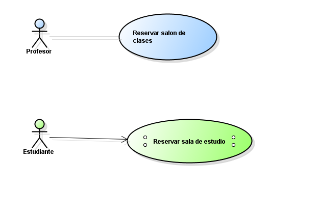

# 📄 Requerimientos del Sistema

## 1. Lista general de requerimientos

El sistema de SILABINFO tiene los siguientes requerimientos (descripción a alto nivel):

### 1.1 Requerimientos funcionales

El sistema de SILABINFO debe tener la capacidad de:

1. Se debe poder gestionar laboratorios,salones de clase, oficinas, salas de estudio y equipos

2. Los salones de clase solo se pueden reservar por maximo 180 minutos, las oficinas por maximo 240 minutos, las salas de estudio por 60 min, y los equipos por 60 minutos.
3. Los salones de clase solo pueden ser reservados por monitores o profesores.

### 1.2 Requerimientos  no funcionales

El sistema de SILABINFO debe tener:

1. Debe tener los colores relacionados de la decanatura de sistemas (color verde)
2. Debe ser responsive y tener una tipología legible.

## 2. Diagramas de caso de uso

### 2.1 Requerimiento Funcional 1

| Campo | Descripción                                                                                                                             |
|------|-----------------------------------------------------------------------------------------------------------------------------------------|
| **ID** | RF-01                                                                                                                                   |
| **Nombre del requerimiento** | Reserva de salones de clase                                                                                                             |
| **Descripción** | El sistema debe poder reservar un salon de clases, pero solo lo puede reservar un profesor o un monitor                                 |
| **Precondiciones** | Para que el sistema cumpla con este requerimiento, Silabinfo debe tener previamente un sistema el cual se puedan reservar los salones   |
| **Actor** | Profesor                                                                                                                                |
| **Flujo principal** | 1. El profesor desea reservar el salon mediante la aplicacion, luego el sistema tiene que hacerle la reserva y mirar si esta disponible o no | |
| **Diagrama de caso de uso** | *imagen y link*                                                                                                                         |
| **Poscondiciones** | Se espera como resultado que quede correctamente la reserva                                                                             |

### 2.2 Requerimiento Funcional 2

| Campo | Descripción                                                                                                                                         |
|------|-----------------------------------------------------------------------------------------------------------------------------------------------------|
| **ID** | RF-02                                                                                                                                               |
| **Nombre del requerimiento** | Reserva de una sala de estudio                                                                                                                      |
| **Descripción** | El sistema debe poder realizar la reserva de una sala de estudio                                                                                    |
| **Precondiciones** | *Para que el sistema cumpla con este requerimiento, Silabinfo debe tener previamente un sistema que permita hacer las reservas.*                    |
| **Actor** | Estudiante                                                                                                                                          |
| **Flujo principal** | 1. El estudiante hace la reserva de la sala de estudio mediante el uso de la aplicacion … 2. El sistema reserva correctamente la sala de estudio |
| **Diagrama de caso de uso** | *"Arriba"*                                                                                                                                          |
| **Poscondiciones** | *Se espera como resultado que se puede reservar la sala de estudio para el estudiante correctamente *                                               |

